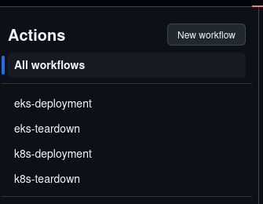

# EKS Cluster Minimal Setup
Worked through EKS example for Creating a VPC, EKS cluster and Adding Ingress or Gateway API.

## Features

- **Automated EKS Cluster Creation**: The repository includes Terraform configuration to define the necessary resources for setting up an EKS cluster, including worker nodes (EC2 instances), VPC, security groups, IAM roles, and Gateway API via a Network Load Balancer.
- **GitHub Actions Integration**: GitHub Actions workflows (`eks_deployment.yml` and `k8s_deployment.yml`) are included to automate the process of creating the EKS cluster and Ingress.
- **Network Load Balancer**: The repository includes a `k8s/gateway.tf` file that provisions a Network Load Balancer for the EKS cluster, enabling load balancing capabilities for services like Kong or NGINX Ingress Controller.
- **Infrastructure as Code (IaC)**: By using Terraform configurations and integrating with GitHub Actions, the repository follows the principles of Infrastructure as Code (IaC), enabling version control, reproducibility, and easier collaboration when managing the EKS cluster infrastructure.
- **Choice of Gateway API**: Both Kong and Nginx gateway APIs have been included. This can be configured via the `k8s/variables.tf` files.

")


## Repository Directory structure

- ````./bootstrap```` contains tofu scripts designed to create a github oidc user to allow github actions to work, state bucket and DDB table.
- ````./eks```` contains tofu scripts to create an EKS cluster inside a VPC.
- ````./k8s```` contains tofu scripts/helm charts to deploy a Kong or Nginx Gateway API network load balancer in EKS.


## Bootstrapping

Login to AWS after setting the access key and secret access key. Use the bootstrap directory to create the state bucket,  DynamoDB locking table and Github oidc user to be used to deploy the rest of the terraform.

````
$ export AWS_ACCESS_KEY_ID=""
$ export AWS_SECRET_ACCESS_KEY=""
$ cd bootstrap
$ tofu init
$ tofu plan
$ tofu apply
````

### Optional Add ACM (TLS) Certificate

Add a wildcard certificate using ACM:


Either create Github Actions for the Project or add ````terraform.tfvars```` in both the eks and k8s directories

#### Github actions

Fork the repo, then check the github actions exist:



Add AWS_REGION and TF_VAR_STATE_BUCKET variables:


Add ROLE_TO_ASSUME as a secret:


#### Deploying from the CLI

Set the following in a ````terraform.tfvars```` file in both the eks and k8s directories:

````
# Set as Variable
AWS_REGION="eu-west-2"
TF_VAR_STATE_BUCKET="bucket_name_created_in_the_bootstrap_process"

# Set as Secret
ROLE_TO_ASSUME=arn:aws:iam::0123456789:role/github-oidc-provider-eksmvp-dev
````
## Infrastructure Deployment

To deploy the infrastructure parts of the stack, either use the github action ````eks-deployment```` or deploy using the CLI and use ````terraform.tfvars```` with environment variables.

````
$ cd eks
$ export AWS_ACCESS_KEY_ID=""
$ export AWS_SECRET_ACCESS_KEY=""
$ cd bootstrap
$ tofu init
$ tofu plan
$ tofu apply
````

Note that the `cluster_endpoint_public_access_cidrs` inside `eks/eks.tf` should be configured for the IPs which are allowed to manage the cluster via kubectl/API. Because github uses more than 100 IPs, and only 100 allowed CIDRs being allowed for this parameter, it would be better to use github runners.


## Kubernetes Deployment

Once the infrastructure part is complete, the kubernetes stack can be added (including the network load balancer), either use the github action ````k8s-deployment```` or deploy using the CLI and use ````terraform.tfvars```` with environment variables.

````
$ cd ../k8s
$ export AWS_ACCESS_KEY_ID=""
$ export AWS_SECRET_ACCESS_KEY=""
$ cd bootstrap
$ tofu init
$ tofu plan
$ tofu apply
````

### Example terraform.tfvars

If deploying using the CLI, create ````terraform.tfvars```` in both the eks and k8s directories.  This file may look like the following:

````
state_bucket = "eksmvp-dev20240123456789123450000001"
aws_region = "eu-west-2"
````

### Interacting with the EKS cluster using the CLI
````
aws eks --region eu-west-2 update-kubeconfig --name $(aws eks list-clusters --region=eu-west-2 --query 'clusters[]' --output text)
````

## Outputs

### NGINX Gateway API

````
$ curl http://k8s-nginxgat-nginxgat-5d8a903d87-d761397e23239b9d.elb.eu-west-2.amazonaws.com -H "Host: cafe.chegwin.org"  -k
Server address: 10.123.156.92:8080
Server name: coffee-56b44d4c55-c6chn
Date: 14/Sep/2024:19:06:00 +0000
URI: /
Request ID: ea91727de9f12e1afcefd3ba4c191480


$ curl https://k8s-nginxgat-nginxgat-5d8a903d87-d761397e23239b9d.elb.eu-west-2.amazonaws.com -H "Host: cafe.chegwin.org"  -k
Server address: 10.123.156.92:8080
Server name: coffee-56b44d4c55-c6chn
Date: 14/Sep/2024:19:05:23 +0000
URI: /
Request ID: 5812678db94e2f9225e67fab47172509

$ kubectl get pods, svc, gateway, httproute -n nginx-gateway

NAME                                        READY   STATUS    RESTARTS   AGE
pod/nginx-gateway-fabric-57d77c8ccf-ptglg   2/2     Running   0          8m16s

NAME                           TYPE           CLUSTER-IP      EXTERNAL-IP                                                                     PORT(S)                      AGE
service/nginx-gateway-fabric   LoadBalancer   172.20.80.177   k8s-nginxgat-nginxgat-5d8a903d87-d761397e23239b9d.elb.eu-west-2.amazonaws.com   80:31898/TCP,443:31047/TCP   8m16s
NAME                          READY   STATUS    RESTARTS   AGE
pod/coffee-56b44d4c55-c6chn   1/1     Running   0          21m

NAME                                     CLASS   ADDRESS                                                                         PROGRAMMED   AGE
gateway.gateway.networking.k8s.io/cafe   nginx   k8s-nginxgat-nginxgat-5d8a903d87-d761397e23239b9d.elb.eu-west-2.amazonaws.com   True         21m

NAME                                         HOSTNAMES              AGE
httproute.gateway.networking.k8s.io/coffee   ["cafe.chegwin.org"]   21m

````

### Kong Gateway API

````
$ curl https://k8s-kongpubl-kongpubl-d214748978-774b37fddc808874.elb.eu-west-2.amazonaws.com/echo -k   
Welcome, you are connected to node ip-10-123-134-216.eu-west-2.compute.internal.
Running on Pod echo-57ffc6dfcf-8nmdm.
In namespace default.
With IP address 10.123.141.223.
````

### References

Kong + Terraform/IaC + Helm + AWS EKS documentation is sparse. I'd love to see more recipes for full installations including annotations.

- [ Kubernetes Gateway API Reference Docs](https://gateway-api.sigs.k8s.io/)
- [ Nginx Gateway Fabric Installation ](https://docs.nginx.com/nginx-gateway-fabric/installation/installing-ngf/helm/)
- [ Kong Gateway API Installation](https://docs.konghq.com/kubernetes-ingress-controller/latest/install/helm/)
- [ Kong KIC EKS ](https://docs.konghq.com/kubernetes-ingress-controller/latest/install/cloud/eks/)

## Contributing

Contributions to this repository are welcome. If you find any issues or have suggestions for improvements, please open an issue or submit a pull request.

## License

This repository is licensed under the [GNU General Public License v3.0](LICENSE).
